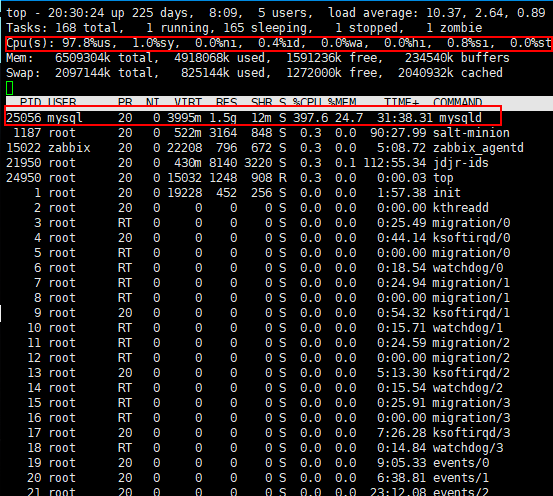
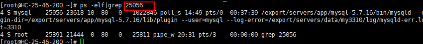
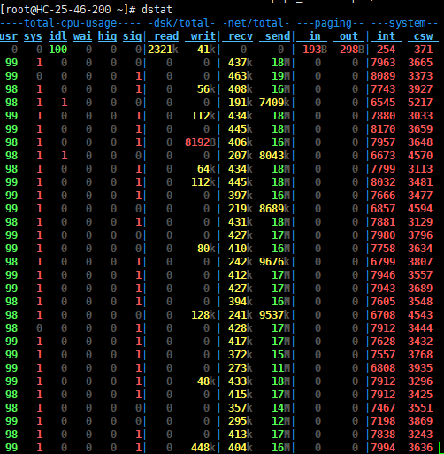

## 1. 系统概览--TOP

- 命令：top
- 主要信息：进程情况，CPU，内存，SWAP
- 常用快捷键：在TOP命令状态下输入**大写P，则结果按CPU占用降序排序**。输入**大写M，结果按内存占用降序排序。**（注：大写P可以在capslock状态输入p，或者按Shift+p）
- DEMO：

1. Mysql吃光CPU

   

2. 根据进程PID确定进程明细信息

   


## 2. 系统资源监控--dstat

- 安装：\# sudo apt-get install dstat	      	  # yum install dstat

- 命令：

  - dstat

  - dstat 3 10

  - dstat -c --top-cpu -d --top-bio --top-latency【查看当前占用I/O、cpu、内存等最高的进程信息】

  - dstat -t --proc-count --top-cpu --top-mem --top-io --net-packets -lpmsa --output /tmp/sampleoutput.csv  【分别显示统计时间/进程数量/占用cpu最多的进程名/占用内存最多的进程名/网络包发送量等等信息.输出一个csv格式的文件】

    

  

  ​

- 方法

  - CPU状态：当CPU的状态处在"waits"时，那是因为它正在等待I/O设备（例如内存，磁盘或者网络）的响应而且还没有收到。CPU状态：当CPU的状态处在"waits"时，那是因为它正在等待I/O设备（例如内存，磁盘或者网络）的响应而且还没有收到。
  - 参数： 

    - -l ：显示负载统计量
    - -m ：显示内存使用率（包括used，buffer，cache，free值）
    - -r ：显示I/O统计
    - -d：磁盘读写
    - -s ：显示交换分区使用情况
    - -t ：将当前时间显示在第一行
    - –fs ：显示文件系统统计数据（包括文件总数量和inodes值）
    - –nocolor ：不显示颜色（有时候有用）
    - –socket ：显示网络统计数据
    - –tcp ：显示常用的TCP统计
    - –udp ：显示监听的UDP接口及其当前用量的一些动态数据
  - 当然不止这些用法，dstat附带了一些插件很大程度地扩展了它的功能。你可以通过查看/usr/share/dstat目录来查看它们的一些使用方法，常用的有这些：
    - -–disk-util ：显示某一时间磁盘的忙碌状况
    - -–freespace ：显示当前磁盘空间使用率
    - -–proc-count ：显示正在运行的程序数量
    - -–top-bio ：指出块I/O最大的进程
    - -–top-cpu ：图形化显示CPU占用最大的进程
    - -–top-io ：显示正常I/O最大的进程
    - -–top-mem ：显示占用最多内存的进程


- 特性

  - 结合了vmstat，iostat，ifstat，netstat以及更多的信息
  - 实时显示统计情况
  - 在分析和排障时可以通过启用监控项并排序
  - 模块化设计
  - 使用python编写的，更方便扩展现有的工作任务
  - 容易扩展和添加你的计数器（请为此做出贡献）
  - 包含的许多扩展插件充分说明了增加新的监控项目是很方便的
  - 可以分组统计块设备/网络设备，并给出总数
  - 可以显示每台设备的当前状态
  - 极准确的时间精度，即便是系统负荷较高也不会延迟显示
  - 显示准确地单位和和限制转换误差范围
  - 用不同的颜色显示不同的单位
  - 显示中间结果延时小于1秒
  - 支持输出CSV格式报表，并能导入到Gnumeric和Excel以生成图形


## 3. 查看系统IO占用情况--iostat

- 基本查询

```
# iostat -d -k 1 10
Device:            tps    kB_read/s    kB_wrtn/s    kB_read    kB_wrtn
sda              39.29        21.14         1.44  441339807   29990031
sda1              0.00         0.00         0.00       1623        523

tps：该设备每秒的传输次数（Indicate the number of transfers per second that were issued to the device.）。"一次传输"意思是"一次I/O请求"。多个逻辑请求可能会被合并为"一次I/O请求"。"一次传输"请求的大小是未知的。
kB_read/s：每秒从设备（drive expressed）读取的数据量；
kB_wrtn/s：每秒向设备（drive expressed）写入的数据量；
kB_read：读取的总数据量；
kB_wrtn：写入的总数量数据量；这些单位都为Kilobytes。
```
- 查询扩展信息

```
# iostat -d -x -k 1 10
Device:    rrqm/s wrqm/s   r/s   w/s  rsec/s  wsec/s    rkB/s    wkB/s avgrq-sz avgqu-sz   await  svctm  %util
sda          1.56  28.31  7.80 31.49   42.51    2.92    21.26     1.46     1.16     0.03    0.79   2.62  10.28
Device:    rrqm/s wrqm/s   r/s   w/s  rsec/s  wsec/s    rkB/s    wkB/s avgrq-sz avgqu-sz   await  svctm  %util
sda          2.00  20.00 381.00  7.00 12320.00  216.00  6160.00   108.00    32.31     1.75    4.50   2.17  84.20

rrqm/s：每秒这个设备相关的读取请求有多少被Merge了（当系统调用需要读取数据的时候，VFS将请求发到各个FS，如果FS发现不同的读取请求读取的是相同Block的数据，FS会将这个请求合并Merge）；wrqm/s：每秒这个设备相关的写入请求有多少被Merge了。

rsec/s：每秒读取的扇区数；
wsec/：每秒写入的扇区数。
rKB/s：The number of read requests that were issued to the device per second；
wKB/s：The number of write requests that were issued to the device per second；
avgrq-sz 平均请求扇区的大小
avgqu-sz 是平均请求队列的长度。毫无疑问，队列长度越短越好。    
await：每一个IO请求的处理的平均时间（单位是微秒毫秒）。这里可以理解为IO的响应时间。这个时间包括了队列时间和服务时间。
svctm：表示平均每次设备I/O操作的服务时间（以毫秒为单位）。
%util：在统计时间内所有处理IO时间，除以总共统计时间。例如，如果统计间隔1秒，该设备有0.8秒在处理IO，而0.2秒闲置，那么该设备的%util = 0.8/1 = 80%，所以该参数暗示了设备的繁忙程度。
```

- 常见用法

```
iostat -d -k 1 10         #查看TPS和吞吐量信息(磁盘读写速度单位为KB,参数-m 单位为MB)
iostat -d -x -k 1 10      #查看设备使用率（%util）、响应时间（await） iostat -c 1 10 #查看cpu状态
```

- DEMO ：

```
# iostat -d -k 1 |grep sda10
Device:            tps    kB_read/s    kB_wrtn/s    kB_read    kB_wrtn
sda10            60.72        18.95        71.53  395637647 1493241908
sda10           299.02      4266.67       129.41       4352        132
sda10           483.84      4589.90      4117.17       4544       4076
sda10           218.00      3360.00       100.00       3360        100
sda10           546.00      8784.00       124.00       8784        124
sda10           827.00     13232.00       136.00      13232        136
上面看到，磁盘每秒传输次数平均约400；每秒磁盘读取约5MB，写入约1MB。

# iostat -d -x -k 1
Device:    rrqm/s wrqm/s   r/s   w/s  rsec/s  wsec/s    rkB/s    wkB/s avgrq-sz avgqu-sz   await  svctm  %util
sda          1.56  28.31  7.84 31.50   43.65    3.16    21.82     1.58     1.19     0.03    0.80   2.61  10.29
sda          1.98  24.75 419.80  6.93 13465.35  253.47  6732.67   126.73    32.15     2.00    4.70   2.00  85.25
sda          3.06  41.84 444.90 54.08 14204.08 2048.98  7102.04  1024.49    32.57     2.10    4.21   1.85  92.24
可以看到磁盘的平均响应时间<5ms，磁盘使用率>80。磁盘响应正常，但是已经很繁忙了。

```
一般地**系统IO响应时间await应该低于5ms**，如果大于10ms就比较大了。

若**svctm的值与await很接近，表示几乎没有I/O等待，磁盘性能很好**，如果**await的值远高于svctm的值，则表示I/O队列等待太长，系统上运行的应用程序将变慢**。

**%util一般地，如果该参数是100%表示设备已经接近满负荷运行了**（当然如果是多磁盘，即使%util是100%，因为磁盘的并发能力，所以磁盘使用未必就到了瓶颈）。